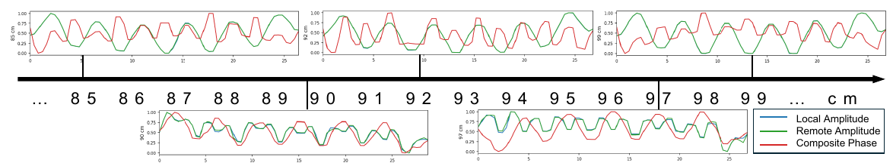
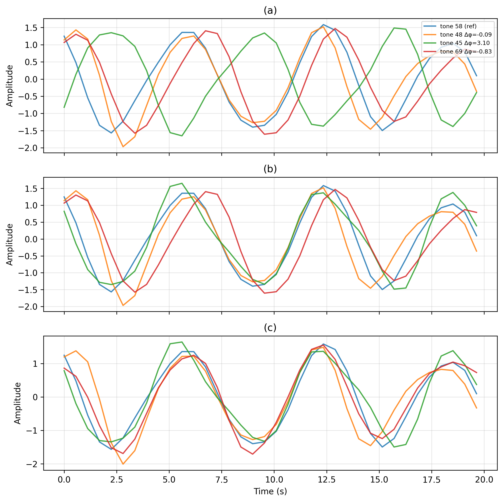

# BreatheCS: Spectral Fusion and Coherent Waveform Reconstruction for Respiration Sensing with Bluetooth Channel Sounding

# BreatheCS：融合双向 BLE 信道探测测量的非接触式呼吸感知——频谱融合与相干波形重建

> **DRAFT v0.5** — 收紧 selective-fusion 叙事：摘要/方法概述与 §5.5（R+L 融合 + Phase 候选选择）对齐；修正术语与公式笔误。跳过伦理/GT/统计补段（待后续）。  
> **日期**：2026-08-11  
> **上版**：v0.4 (2026-07-26)  

---

## Abstract / 摘要

**EN**: Bluetooth Channel Sounding (CS) exposes multi-frequency bidirectional measurements that enable contactless respiration sensing on low-power BLE devices. Unlike WiFi CSI, however, BLE CS provides two endpoint amplitude observations and a composite-phase observation derived from reciprocal PCT exchanges, while operating at a sparse and potentially irregular event rate. We show that these observables should not be treated as interchangeable channels: tone diversity provides consistent sensing gain, whereas composite phase is physically complementary to amplitude but conditionally reliable for natural respiration. We present BreatheCS, a measurement-aware framework that separates respiratory-rate estimation from waveform reconstruction. For BPM estimation, BreatheCS aggregates quality-weighted tone spectra, which is robust to residual inter-tone timing and phase mismatch. For waveform recovery, it coherently aligns tones within each endpoint-amplitude modality in the complex domain, fuses the aligned endpoint candidates, and selectively chooses between the amplitude and composite-phase candidates according to window-level quality. Across three controlled mechanical-motion settings and 12 human recordings from four participants in three indoor sensing scenarios, BreatheCS achieves a mean absolute BPM error of 0.371 breaths/min and a normalized waveform RMSE of 0.937. Ablations show that tone aggregation is the dominant source of improvement (1.640 to 0.381 breaths/min), while unconditional inclusion of composite phase is less reliable than endpoint-amplitude sensing. These findings indicate that BLE CS sensing requires task-specific and reliability-aware fusion rather than direct migration of WiFi CSI fusion assumptions.

**CN**: 蓝牙信道探测（Channel Sounding, CS）通过互易 PCT 交换提供两个端侧幅值观测与一个组合相位观测，为低功耗 BLE 上的非接触呼吸感知提供了新的测量原语；但其稀疏、可能不均匀的事件率，以及 信道channel/模态间连续相位关系，对合理利用观测量提出了新挑战。本文通过多个场景的受控金属板实验发掘并验证BLE CS的观测特性，随后提出BreatheCS：将呼吸率估计与波形恢复分开处理。BPM 分支做质量加权谱聚合；波形分支在各端侧幅值模态内做复平面相干对齐。两个分支在各自任务上融合端侧幅值候选后，再按窗级质量在幅值候选与组合相位候选之间选择，以确定最终估计。 通过在四名受试者、三种室内感知场景下的 12 条真人记录上验证性能，BreatheCS 的平均绝对 BPM 误差为 0.371 breaths/min，归一化波形 RMSE 为 0.937。消融表明信道聚合是主导且稳定的增益来源，组合相位在大多数情况下不如端侧幅值可靠。结论是：BLE CS 的呼吸感知需要对观测特性做针对性算法设计，才能获得最佳的呼吸监测性能。

## 1. Introduction / 引言

### 1.1 问题与应用价值

Respiration is a fundamental physiological indicator for sleep monitoring, chronic disease management, and early detection of respiratory abnormalities. Conventional monitoring solutions typically require wearable belts, electrodes, or dedicated radar hardware, which can limit comfort and long-term deployment. Device-free sensing using commodity wireless signals offers an attractive alternative because it can capture respiration-induced channel variations without requiring the user to wear a sensor.

呼吸是睡眠监测、慢病管理和呼吸异常早期检测的基础生理指标。传统监测方案通常需要穿戴式绑带、电极或专用雷达硬件，在舒适性和长期部署上存在限制。使用商用无线信号的非接触式感知提供了一种有吸引力的替代方案——无需佩戴传感器即可捕获呼吸引起的信道变化。

### 1.2 为什么 BLE Channel Sounding 值得研究？

BLE is widely deployed, and Channel Sounding (CS) is becoming available in a new generation of Bluetooth Core 6.0-capable chipsets. CS was designed for secure fine ranging via Phase-Based Ranging (PBR) and Round-Trip Timing (RTT), but it simultaneously exposes bidirectional phase-related measurements over up to 72 RF channels—creating a new opportunity for device-free sensing on energy-efficient BLE platforms. However, CS was designed for ranging rather than physiological sensing, and its measurement structure differs substantially from the WiFi CSI commonly used in prior respiration systems.

BLE 已广泛部署，Channel Sounding（CS）正在新一代支持 Bluetooth Core 6.0 的芯片组中可用。CS 本为通过基于相位的测距（PBR）和往返时间（RTT）实现安全的精细测距而设计，但它同时暴露了跨多达 72 个 RF 信道的双向相位相关测量，这为低功耗 BLE 平台上的非接触式感知创造了新机遇。但我们发现，CS 测量结构与呼吸感知系统并不直接适配，因为它的技术特性仅考虑了测距需求。

### 1.3 为什么 WiFi 方法不能直接迁移？

Directly migrating WiFi respiration pipelines to BLE CS is problematic for three reasons:

**Difference 1: Observable structure.** WiFi typically provides single-ended complex CSI or antenna/subcarrier ratios. BLE CS produces two endpoint PCT measurements from a reciprocal bidirectional exchange. After combining them to suppress local-oscillator offsets, we obtain two endpoint amplitude observables (`remote_amplitudes`, `local_amplitudes`) and one composite-phase observable (`phases`). These three observables represent different complex-plane projections of the same channel perturbation rather than independent propagation paths.

**Difference 2: Sampling conditions.** A BLE CS event typically completes in 250–500 ms, yielding an effective rate of 2–4 Hz. In a 20-second sliding window at this rate, only 2–7 respiratory cycles (at 0.1–0.35 Hz) are available, with uncertain and potentially uneven inter-event intervals. Short-window temporal alignment is therefore sensitive to timing irregularity, noise, and non-stationary motion—more so than in typical WiFi CSI streams.

**Difference 3: Inter-tone and inter-modal phase relationships.** Frequency-selective multipath and implementation non-idealities produce continuous, scene-dependent phase offsets across tones and across observation modalities (remote/local/phase). These offsets go beyond the binary in-phase/anti-phase (±1) relationship commonly assumed in WiFi Fresnel-zone models. Many existing fusion methods (PCA sign correction, MRC with fixed reference) assume only a binary relationship and are therefore insufficient.

通过受控的金属板实验，我们观察到在BLE CS 上应用呼吸感知管线存在三个挑战：

**挑战 1：观测结构。** BLE CS 通过互易双向交换产生两个端侧 PCT 测量。将它们组合以抵消本振偏置后，我们获得两个端侧幅值观测量（remote_amplitudes、local_amplitudes）和一个组合相位观测量（phases）。现有的感知方案，例如WiFi，则通常提供单向复 CSI 或天线/子载波比值。

**挑战 2：采样条件。** BLE CS 事件通常在 250–500 ms 内完成，有效速率 2–4 Hz。在此速率下的 20 秒滑窗中，仅有 2–7 个呼吸周期（0.1–0.35 Hz），且事件间隔可能不均匀。短窗时域对齐因此对时序误差、噪声和非平稳运动更敏感。

**挑战 3：信道间与模态间的相位关系。** 频率选择性多径和实现非理想性导致信道间和观测模态间（remote/local/phase）产生连续、场景依赖的相位偏移。这些偏移超越了典型的二值同相/反相关系。许多现有融合方法【PCA、MRC】仅假设二值关系，因而不充分。

### 1.4 关键实验洞察

Our measurements lead to three design insights:

1. **Tone diversity is the dominant gain.** Reliable tone aggregation provides the largest and most consistent improvement because individual CS tones exhibit strongly varying respiration sensitivity (single-tone BPM error 1.640 → channel-fused 0.381 BPM). No single tone or small subset of tones is consistently reliable across scenes.

2. **Respiratory rate and waveform require different fusion domains.** Magnitude spectra discard timing information and are therefore robust to residual temporal offsets between tones—making them ideal for BPM estimation. Waveform recovery, in contrast, requires coherent phase alignment to preserve morphological features. Forcing a single fusion mechanism to serve both objectives degrades at least one of them.

3. **Modal diversity is reliability-limited, not universally beneficial.** Although endpoint amplitudes and composite phase represent different projections of the channel perturbation, their mathematical complementarity does not guarantee practical fusion gain. Composite phase was competitive under controlled periodic motion but substantially less reliable for natural human respiration: it more often degraded than improved correct BPM estimates, and oracle analysis shows it is best in only a small fraction of human windows. Modal inclusion must therefore be selective, depending on measurement reliability rather than physical availability alone.

我们的测量产生了三条设计洞察：

1. **Channel diversity 是主要增益。** 可靠的 信道聚合提供了最大且最稳定的改进，因为各 CS 信道的呼吸灵敏度差异显著（单 tone BPM 误差 1.640 → 信道融合 0.381 BPM）。没有任何单一 tone 或少量 tone 子集在所有场景中持续可靠。

2. **呼吸率和波形需要不同的融合域。** 幅度谱丢弃了时间信息，因此对信道间的残余时间偏移稳健。波形恢复则需要相干相位对齐以保留形态学特征。

3. **模态分集的价值受观测可靠性限制。** Remote 和 Local 幅值物理对等，但并非在每个窗口中都同等可靠。组合相位虽与幅值形成径向/切向互补，但在真人自然呼吸中可靠性显著下降。

### 1.5 方法概述

Guided by these insights, we design BreatheCS, a measurement-aware dual-branch pipeline. A shared front-end scores tones using respiratory-band concentration $\eta$ and spectral peak prominence $\rho$. For BPM estimation, BreatheCS aggregates quality-weighted magnitude spectra across tones. For waveform recovery, it coherently aligns tones within each endpoint-amplitude modality in the complex domain, fuses the aligned Remote/Local candidates into an endpoint-amplitude candidate, and selectively chooses between that candidate and the composite-phase candidate according to window-level quality—rather than forcing all observables into a single coherent fusion output.

基于这些洞察，我们设计了 BreatheCS。共享前端用 $\eta$（呼吸频段能量集中度）为各 tone 打分。BPM 分支跨 信道做质量加权幅度谱聚合，随后在幅值与合成相位模态中选择能量更高的一项。波形分支先在各端侧幅值模态内做复平面相干对齐，再融合 Remote/Local 得到端侧幅值候选，并按窗级质量在幅值候选与组合相位候选之间选择。

### 1.6 贡献

This paper makes the following contributions:

1. **BLE CS respiration observation model and empirical characterization.** We formulate the bidirectional PCT measurements as two endpoint amplitude observables and one composite-phase observable, and characterize their complex-plane sensitivities, inter-tone relationships, and scene-dependent inter-modal phase offsets. Our analysis reveals why BLE CS respiration sensing cannot be treated as a direct low-rate migration of WiFi CSI sensing.

2. **Task-specific reliability-aware fusion.** We develop BreatheCS with a shared quality-aware tone front-end, a spectral branch for timing-robust BPM estimation, and a waveform branch that performs coherent endpoint-amplitude alignment followed by selective amplitude-vs-phase candidate choice.

3. **Diversity hierarchy and selective modal use.** Through fusion-level ablation, single-modal evaluation, and oracle analysis, we show that tone diversity is the dominant and consistent gain source, whereas composite phase—though physically complementary—is only conditionally useful for natural respiration and should be used selectively rather than unconditionally fused.

本文做出以下贡献：

1. **BLE CS 呼吸观测建模与实证刻画。** 建立双向 PCT 呼吸观测模型，将可用测量表示为两个端侧幅值观测与一个组合相位观测，并分析其复平面灵敏度、tone 间关系以及场景相关的模态间相位关系。

2. **任务专用、可靠性感知的融合。** 提出 BreatheCS：共享质量驱动的 tone 前端；谱域分支做稳健 BPM 估计；波形分支先做端侧幅值相干对齐，再在幅值与组合相位候选间按窗选择。

3. **分集增益层级与选择性模态使用。** 通过融合层级消融、单模态对照与 oracle 分析，表明 信道diversity 是主导且稳定的增益；组合相位虽物理互补，但对自然呼吸性能下降，大多数情况下仍不及幅值模态。

### 中心论点

The central thesis connecting all sections of this paper is:

> **BLE CS is not simply WiFi CSI sampled at a lower rate; its bidirectional measurement structure, sparse event sampling, and frequency-dependent phase relationships require task-specific fusion for respiratory rate and waveform sensing.**

贯穿全文的中心论点：

> **BLE CS 并不是低采样率版本的 WiFi CSI：其双向 PCT 观测结构、稀疏事件采样及频率相关的连续相位关系，使呼吸率估计和波形恢复需要不同的融合原则。**

## 2. Related Work

Related work spans three areas: contactless respiration sensing, WiFi CSI modeling and multi-channel fusion, and Bluetooth sensing with Channel Sounding. We organize by theme rather than by paper, and highlight what is missing for BLE CS.

### 2.1 Contactless Respiration Sensing

| Technology | Strengths | Key difference from this work |
|---|---|---|
| FMCW/UWB Radar | High sampling rate, range resolution | Requires dedicated hardware |
| WiFi CSI | Many subcarriers, typically higher sampling rate | Different measurement primitive (single-ended CSI vs bidirectional PCT) |
| BLE RSSI | Low power, ubiquitous | Only coarse-grained signal strength |
| BLE CS | Bidirectional, multi-frequency, phase-capable | New measurement structure; respiration sensing uncharacterized |

Prior respiration sensing systems have been dominated by WiFi CSI and radar. Their signal models and fusion assumptions do not directly describe the bidirectional PCT observations exposed by BLE CS.

> **Gap**: Existing respiration systems are built on measurement primitives (CSI, RSSI, radar IF) that differ fundamentally from BLE CS's reciprocal PCT structure. Their fusion strategies do not account for the specific tone-modal relationships we characterize here.

### 2.2 WiFi CSI Modeling and Multi-Channel Fusion

**Fresnel-zone and multipath modeling.** Respiration-induced path-length variation causes periodic channel changes. Amplitude and phase sensitivity depend on the multipath operating point—different subcarriers or links exhibit different sensitivity to the same physical motion. This body of work establishes the theoretical basis for multi-channel respiration sensing, but the models assume single-ended CSI rather than bidirectional PCT.

**Amplitude–phase complementarity.** FullBreathe (Zhang et al.) exploits the orthogonal complementarity between CSI amplitude and phase to mitigate blind spots; FarSense uses dual-antenna CSI ratios to relieve phase bias and jointly exploit amplitude and phase information to extend sensing range. These works demonstrate that amplitude and phase can have complementary rather than redundant information. However, in these methods, amplitude and phase typically come from the same WiFi CSI or antenna ratio. In BLE CS, Remote/Local amplitudes and composite Phase arise from bidirectional PCT exchange and represent different complex-plane projections—not directly comparable to WiFi's amplitude/phase decomposition. Moreover, FullBreathe itself notes that standalone amplitude or phase can both have blind spots; their value lies in complementarity, not in phase being universally blind-spot-free.

**Subcarrier/link fusion and signal decomposition.** PCA/SVD-based methods extract the dominant respiratory component across subcarriers. MRC assigns weights proportional to channel quality. VMD/EMD decompose signals into modes for respiratory component selection. Position-Free Breath Detection (Zhuo et al.) combines CSI ratio with PCA–VMD fusion to mitigate position and noise issues, serving as a suitable migration baseline. However, prior approaches generally fuse channels to produce a single signal and then derive respiration rate from that signal. BreatheCS instead separates spectral rate estimation from coherent waveform reconstruction because the two outputs have different sensitivity to temporal phase errors. WiFi-derived methods remain meaningful migration baselines, but their original fusion assumptions are not guaranteed to hold for BLE CS.

> **Gap**: Prior fusion work often assumes binary phase relationships (±1 sign correction) or decomposes a single fused signal. BLE CS exhibits continuous, scene-dependent inter-tone and inter-modal phase offsets that motivate continuous complex-plane alignment, task-specific fusion domains, and selective modal use.

### 2.3 Bluetooth Sensing and Channel Sounding

Traditional BLE sensing has primarily used RSSI, AoA/AoD, or proprietary channel measurements. Bluetooth Core Specification 6.0 formally introduced Channel Sounding, which includes Phase-Based Ranging (PBR) and Round-Trip Timing (RTT) for secure fine ranging. Early work has begun exploring BLE 6.0 CS for device-free sensing, but remains at the feasibility-demonstration stage. Our prior work demonstrated the feasibility of device-free sensing using BLE CS. This paper goes beyond feasibility by systematically characterizing reciprocal PCT observables for respiration, relating tone diversity to modal diversity, and deriving selective fusion principles for rate estimation versus waveform recovery.

> **Gap**: Existing BLE CS sensing studies have not yet provided a respiration-focused characterization of reciprocal PCT endpoint amplitudes and composite phase, nor a clear account of when tone aggregation versus modal inclusion helps or hurts.

### Summary

In summary, prior wireless respiration research has established Fresnel-based sensing models, amplitude–phase complementarity, and multi-channel fusion for WiFi CSI. Bluetooth CS introduces a different measurement primitive: bidirectional endpoint observations, a composite phase, sparse event sampling, and frequency-dependent tone relationships. How these properties should shape respiratory-rate estimation and waveform recovery—and whether the two objectives should share the same fusion strategy—remains under-specified. BreatheCS addresses this gap.

## 2. 相关工作（中文摘要）

现有无线呼吸感知研究主要围绕 WiFi CSI 和雷达展开，其信号模型和融合假设无法直接描述 BLE CS 的双向 PCT 观测。BLE CS 提供了不同的测量原语——双向端侧观测、组合相位、稀疏事件采样和频率相关的 tone 间关系——这些特征的呼吸感知建模尚属空白。BreatheCS 填补了这一空白。

## 3. BLE CS Primer / BLE CS 基础

### 3.1 BLE CS Physical Primer / BLE CS 物理基础

> **EN**: [Brief description of CS exchange, PCT multiplication, LO drift cancellation. Why remote_amplitudes, local_amplitudes, and phases are the three usable observables. Why total amplitude is not used.]
>
> **CN**: [简述 CS 交换过程、PCT 乘法、LO 漂移抵消。为什么 remote_amplitudes、local_amplitudes、phases 是三个可用观测量。为什么 total amplitude 不可用（双方噪声乘积，无独立物理意义）。]

BLE 6.0 推出了信道探测功能，其中最重要的更新就是引入了基于相位的测距（phase-based ranging, PBR）。CS -PBR （以下简称CS）要求两个设备必须首先连接，确定发起者、接收者的角色，随后在BLE的频段上以1MHz 的带宽为步进依次执行每个信道的测量。在预留一部分信道后，可用信道数为72个。

在每个信道测量中，双方各自向对方发送一个 CS tone，并由接收方测量该 CS tone 的幅值和相位，以 IQ 形式存储，记为 PCT （即 phase correlation term）。双方的PCT 在当前event 结束后会经由 ranging service 收集到一处。

为了抵消两个设备间的本振漂移，将两端 PCT 做复数乘法，使其相位相加、LO 漂移项抵消，就能获得有物理意义的合成相位。我们设两个设备本振的固定相位差为  
$$
\Delta \theta_{LO} = 2\pi F(\varphi_i- \varphi_r),
$$
其中，$F$ 是当前信道频率， $\varphi_i,\varphi_r$分别是发起方、反射方设备对真实时间的延迟。

从发起方出发的CStone ，经过时间 $\tau$后抵达反射方。当我们以发起方作为最终PCT整合方时，反射方就被视为 remote 端。因此，这一过程中的相位变化由反射方记录为 Remote PCT:
$$
\text{PCT}_{\text{Remote}}:\theta_{INI \rarr REF}  = 2\pi F \tau +\Delta \theta_{LO}.
$$

然后交换角色，反射方向发起方发送 CS tone，发起方记录 Local PCT:
$$
\text{PCT}_{\text{Local}}:\theta_{REF \rarr INI} = 2\pi F \tau -\Delta \theta_{LO} .
$$
显然，若将两端 PCT 做复数乘法，相位相加后即可消去未知的 $\Delta\theta_{LO}$。二者均为(a+bi)形式的复数，使用复数乘法就能得到两者的相位之和。最后，我们所获得的可用物理层感知信息就是本地、远端PCT的幅值，以及PCT叠加后的相位（composite phase合成相位），我们分别将其记为：
$$
A_{\text{Local}},A_{\text{Remote}},\Phi
$$
由复数乘法获得的乘积的幅值就是幅值的乘积，并未引入新的物理量，因此不使用。

### 3.2 Effective Sampling Rate and Its Consequences / 有效采样率及其影响

> **EN**: BLE CS events occur at ~250–500 ms intervals (2–4 Hz). After bandpass filtering (0.1–0.35 Hz) and 20-second windowing, each window contains only ~2–7 breathing cycles (e.g., ~4 cycles for typical 0.2 Hz respiration). At this low effective rate, time-domain waveform alignment is more sensitive to event jitter, boundary effects, and non-stationary perturbations than in typical WiFi CSI streams. The spectral domain (|FFT|) discards timing information and is therefore more robust for frequency estimation—though narrowband sinusoidal phase can still be precisely estimated at high SNR. Our experiments confirm that magnitude-spectrum fusion achieves consistently higher BPM robustness.
>
> **CN**: BLE CS 事件的间隔约为 250–500 ms（2–4 Hz）。经带通滤波（0.1–0.35 Hz）和 20 秒滑窗后，每个窗口仅包含约 2–7 个呼吸周期（典型 0.2 Hz 呼吸约 4 个周期）。在此低有效采样率下，时域波形对齐对事件时序抖动、边界效应和非平稳扰动更敏感——比典型 WiFi CSI 数据流更脆弱。频谱域（|FFT|）丢弃了时间信息，因此对频率估计更稳健——但这不意味着时域对齐"本质不可能"，窄带正弦在高 SNR 下仍可精确估计相位。实验确认幅度谱融合在 BPM 稳健性上持续占优。

一个CS流程可能包含多个CS事件，CS事件是包含所有必须步骤的最小测量单位。单个事件内包含多个step，每个step就是某个信道的一次完整的双向测量。 本文启用全部的72信道以获得最大的频谱丰富度。

单个Step的耗时约300us，启用全部的信道后，单个事件的时长约为21ms。但根据BLE6.0规范【引用预留】，远端的PCT需要经由 ranging service 返回，这需要占用更多的时间。我们在nordic nrf54L15 上进行了多次测试，发现最短的事件间隔约为250ms。但如果需要长期执行测量，需要适当放宽最大间隔的上限。因此，实际的事件间隔在 250-500ms之间，频率为2-4Hz。根据奈奎斯特采样定理，这恰好高于呼吸频率的2倍范围，因此可以实现呼吸感知。

## 4. Sensing Respiration with BLE CS / 利用 BLE CS 感知呼吸

本节建立用于解释基于 BLE CS 呼吸感知的观测模型。我们首先分析BLE CS的有效物理观测量；接着，我们尝试构建信道、观测量模态之间的呼吸波形关系，以指导如何融合这些呼吸波形，达到提升信噪比、更好地拟合原始呼吸波形的目标。为此，我们讨论同一模态内 CS 信道之间的关系，并分析顺序 CS 信道扫描是否会引入不可忽略的呼吸相位偏移。最后，我们将模型扩展为多有效成分相量表示，从而解释不同观测模态间的连续性相位偏差，以为所提出的两级相干融合方法提供动机。

### 4.1 Respiratory Observation Model /CS的有效观测变量

在 Section 3.1 中，我们论证了单次CS 测量可获得的变量。在呼吸感知中，我们需要连续进行CS测量，以获得各个变量的时序数据，随后用于进一步提取呼吸。

对于每个 CS 信道 $i$，BLE CS 提供两个 PCT 复数观测：
$$
Z_{l,i}(t), \quad Z_{r,i}(t), \tag{1}
$$
其中 $Z_{l,i}(t)$ 和 $Z_{r,i}(t)$ 分别表示$\text{PCT}_{\text{Local},}$, $\text{PCT}_{\text{Remote}}$ 在时间$t$ 上的采样序列。

随后，我们计算得到三个可用的呼吸感知变量序列：
$$
A_{l,i}(t)=|Z_{l,i}(t)|, \qquad A_{r,i}(t)=|Z_{r,i}(t)|, \\\Phi_i(t)=\operatorname{unwrap} \left( \angle\left(Z_{l,i}(t)Z_{r,i}(t)\right) \right). \tag{2}
$$
其中，$A_{l,i}(t)$ 和 $A_{r,i}(t)$ 是幅度型观测，分别是来自两端设备对环境的观测；而 $\Phi_i(t)$ 是相位型观测。三者具有不同的物理意义。为了论证这一点，考虑一种简单的单一呼吸路径下的情形：
$$
Z_{d,i}(t)=\overline{Z}_{d,i}+\delta Z_{d,i}(t), \quad d\in\{l,r\},\tag{3}
$$
其中 $\overline{Z}_{d,i}$ 是准静态分量，$\delta Z_{d,i}(t)$ 是由呼吸引起的扰动。

当 $|\delta Z_{d,i}(t)|\ll |\overline{Z}_{d,i}|$ 时，归一化幅度扰动近似为扰动在工作点方向上的实投影：
$$
\frac{\delta A_{d,i}(t)}{\overline{A}_{d,i}} \approx \operatorname{Re} \left\{ \frac{\delta Z_{d,i}(t)}{\overline{Z}_{d,i}} \right\},\tag{4}
$$
其中 $\overline{A}_{d,i}=|\overline{Z}_{d,i}|$。相反，积分相位扰动近似为两端扰动的虚投影之和：
$$
\delta \Phi_i(t) \approx \operatorname{Im} \left\{ \frac{\delta Z_{l,i}(t)}{\overline{Z}_{l,i}} + \frac{\delta Z_{r,i}(t)}{\overline{Z}_{r,i}} \right\}.\tag{5}
$$
因此，幅度变量反映复数扰动在径向的投影，而积分相位反映两端切向投影之和。这一区别促使我们将本地幅度、远端幅度和合成相位视为三种具有不同物理意义的呼吸观测模态。

### 4.2 观测量上的呼吸波形

本章节用金属板模拟人体胸腔的位移，以观察本地幅值、远端幅值与合成相位是否具备感知呼吸位移的能力，并确认4.1节中对三种观测模态的关系的推论。

首先，考虑一种单一路径的边界情形：呼吸诱导扰动由单一有效位移成分主导：
$$
\xi(t)=X\cos(\omega_b t+\psi),
$$
其中 $X$、$\omega_b$ 和 $\psi$ 分别表示位移幅度、呼吸角频率和初始相位。

假设在工作点附近，本地和远端 PCT 扰动由该位移线性驱动：
$$
\delta Z_{d,i}(t)=V_{d,i}\xi(t), \quad d\in\{l,r\}.
$$

定义归一化复数灵敏度：
$$
\frac{V_{d,i}}{\overline{Z}_{d,i}} = u_{d,i}+jv_{d,i},
$$
其中 $u_{d,i}$ 和 $v_{d,i}$ 分别为实值径向和切向灵敏度系数。

则三个呼吸观测可写为：
$$
y_{l,i}(t)=u_{l,i}\xi(t),y_{r,i}(t)=u_{r,i}\xi(t),\\
y_{\phi,i}(t)=\left(v_{l,i}+v_{r,i}\right)\xi(t).
$$
为简洁起见，定义：$k_{l,i}=u_{l,i},\quad k_{r,i}=u_{r,i},\quad k_{\phi,i}=v_{l,i}+v_{r,i}.$

则每个观测可写为：
$$
y_{m,i}(t)=k_{m,i}X\cos(\omega_b t+\psi).
$$
等价地，其中幅值$A_{m,i}=|k_{m,i}|X,$ 则相位$\varphi_{m,i}$的偏差只和幅值 $A_{m,i}$ 的系数相关：
$$
\varphi_{m,i}= \begin{cases} \psi, & k_{m,i}>0,\\ \psi+\pi, & k_{m,i}<0. \end{cases}
$$

如果 $|k_{m,i}|\approx 0$，相应观测中包含的呼吸能量很少，其估计相位也会变得不可靠。因此，在单一有效成分和一阶扰动模型下，不同模态或信道之间的呼吸波形只能表现为同相、反相或弱响应。在这一边界情形中，二值符号校正在理论上已经足够。

#### 实验设置：

我们用实验验证BLE CS 的观测量中是否符合上述现象。我们在一个5m宽的空旷的长走廊上搭建了BLE CS 呼吸感知验证平台【图-金属板设置】，以讨论CS各个观测变量。BLE CS 的部署平台是 Nordic nrf54L15 ，这是一款已经上市并支持BLE 6.0 的物联网低功耗蓝牙芯片。我们使用原厂的 nrf54L15 DK （development kit）连接6dBi 的外置天线，然后将平台按间隔1m架设，并保证高度与金属板平齐。用于模拟人体胸腔的金属板尺寸为30*30cm。

我们令一侧作为BLE CS发起方（initiator），另一侧作为接收方。双方数据由发起方汇总，随后通过串口上传到笔记本电脑。我们还需要配置BLE CS 的一些参数，以确保测量频率和信道启用符合我们的预期。具体包括：启用所有信道（72个），测量间隔设置为250-500ms区间。其中，250ms是我们经过多次测试后，BLE CS 在当前6.0版本能够实现的最短间隔。同时，我们在实验中发现，250ms 间隔在长期测量时容易同步失败，导致CS测距中断，因此将最大间隔设置为500ms，以允许偶然超时情况。

在实验中，金属板会周期性前后移动，范围为1cm。金属板初始位置距离BLE CS设备的视距连接（LoS）为100cm，每执行完6次呼吸位移，金属板在滑台上前进1cm，然后再次执行6次呼吸位移。通过这种方式，我们将观察到随着金属板的位置不断移动，双端幅值和合成相位的呼吸波形出现相应的变化。

#### 实验结果：

- 呼吸在同信道不同模态上的差异
- 

我们任意选定一个信道来展示三个模态的波形差异，并将不同位置处的波形予以比较。从【图-amp_pha_complement】我们观察到，随着金属板在滑台上持续步进，各个模态上所观测到的呼吸呈周期性变化，且具备明显的交替互补特性。幅值和合成相位是PCT在径向和切向的投影，金属板建立的多径变化在两者上总有一处可以观测。两种模态的呼吸波形低显著区间是交替出现的，且本地、远端幅值之间几乎重合。

- 不同信道的表现存在差异

我们在ch 20\40\60三个信道上比较呼吸波形的形态，且选择了86/87/88 三个位置处的幅值记录。由图【图-channel_position_matrix 】可见，随着位置改变，信道表现也不一致。在88cm 处，三个信道的表现都较好，前移 1cm 至87cm 后，ch 40 的呼吸不再明显；再前移1cm，ch 60 的呼吸波形出现失真/伪峰，而另外两个信道则波形清晰。这说明 CS PCT 的幅值变化与所处信道相关，信道不同，频率就不同，波形的表现也会有细微差异。

进一步地，我们比较同一位置、同一模态下，所有信道上的波形差异。由图【全信道差异C1扩充】可见，一些信道的波形是同相的，一些则是反相的。

- 同一信道的三种观测量偏差不是整数 pi 

但不同的模态之间并不是只有同相/反相的差异，而是有处于0-pi 之间的相位偏移。我们追踪了不同信道在所有位置处的模态间相位差的变化，【图-position_sweep_figD2_dphi_vs_position_ch20_40_60】显示，大多数情况下，两端幅值基本同相，幅值和相位之间则基本是同相、反相的关系。但值得注意的是，在一些不同的位置，幅值间的相位差不再几乎为0，相位和幅值之间的偏移也不是整数 pi 。这些结果表明，BLE CS 的各个观测量之间存在随机的连续偏移。

- 人体活动和金属板的表现存在差异

我们请来四位 subject ，令其坐在远离 LOS 的固定位置处，距离以其胸腔为准。同时，我们要求他们跟随节拍器呼吸，频率与金属板的设定值一致。我们随后在相同的距离处再次测量金属板的呼吸，并比较波形的差异。为了评价两种波形，我们引入呼吸能量比$\eta$ 和波形的谱峰突出度$\rho$ （spectral peak prominence）两个指标，$\eta$ 在高通滤波后的信号上计算（衡量呼吸频段能量在总频谱中的集中程度），$\rho$ 在呼吸带通滤波后的信号上计算。记模态 $m$、信道$i$ 的波形高通后的功率谱为 $P_{m,i}^{\text{hp}}(f)$ ，带通后的功率谱 $P_{m,i}(f)$ ， $\mathcal{F}_b$ 为呼吸频段，$\mathcal{F}$ 为分析频段。 $\eta$ 和 $\rho$ 定义为：
$$
\eta_{m,i}
=
\frac{\sum_{f\in\mathcal{F}_b}P_{m,i}^{\text{hp}}(f)}{\sum_{f\in\mathcal{F}}P_{m,i}^{\text{hp}}(f)+\epsilon},
$$

（LaTeX: `eq:eta`）

$$
\begin{aligned}
\rho_{m,i}
&=
\frac{P_{m,i}(\widehat{f}_{m,i})}{\frac{1}{|\mathcal{F}_b|}\sum_{f\in\mathcal{F}_b}P_{m,i}(f)+\epsilon},
\\
\widehat{f}_{m,i}
&=
\arg\max_{f\in\mathcal{F}_b}P_{m,i}(f)
\end{aligned}
$$

（LaTeX: `eq:rho`）

【图-position_sweep_figE3_eta_rho_comparison.png】展示了 $\eta$ 和 $\rho$ 在两类目标下的差异。两种呼吸目标在呼吸频段的能量比较为相似，各个模态上都没有明显的下降。但谱峰突出度的下降较为明显。这可能是由于人体自然呼吸含速率漂移、谐波与体动 ，尽管能量仍可落在 0.1–0.35 Hz，但峰不再尖锐。

接下来，通过讨论上述实验结果，我们分别讨论模态内部各信道呼吸波形间的相位关系和模态之间的波形相位关系。

### 4.3  Inter-Channel Phase Relationship / 信道间波形的相位关系

> **EN**: [Fresnel zone theory review. Applicability to BLE CS. PCA sign correction works → confirms ±1 baseline. But Hilbert continuous phase further improves → confirms additional structure from sequential sampling. Cite Figure 2.]
>
> **CN**: [回顾菲涅尔区理论。在 BLE CS 中的适用性论证。PCA 符号校正有效 → 确认 ±1 基线成立。但 Hilbert 连续相位补偿进一步改善 ]

不同信道的频率不同，对于同样的呼吸活动，所引发的信道衰落也会有差异。同一模态内部各信道的物理意义是相同的，因此，如果按照菲涅尔区理论【相关WIFI的论文】，它们之间的菲涅尔区边界会因为频率不同而略微有区别。对于同样的呼吸扰动，它们的影响要么是同相的，要么恰好是反相的。因此在过去的一些感知工作中，为了合并所有信道的波形以获得最大的信噪比，通常仅考虑计算同相/反相的情况，为各信道赋予符号，以将所有信道的波形进行正确的相干合并【相关WIFI的论文】。

仍考虑在静态工作点附近，由呼吸活动产生的一个微小扰动（等式 3），将其在工作点$\overline{Z}_{d,i}$附近做一阶泰勒展开
$$
Z_{d,i}(t)\approx \underbrace{Z_{d,i}^{(0)}} _{\text{Static}}+\underbrace{k_{d,i}\xi(t)} _{\text{Dynamic}},
$$
此时，静态分量可通过滤波等方式去除，剩余的动态项的系数和信道的频率相关。对于两个比较的信道 $Ch_i,Ch_j$，如果 $k_{d,i}k_{d,j}>0$那么两个 CS 信道观测同相；如果 $k_{d,i}k_{d,j}<0$，它们反相；如果任一系数接近零，则对应信道为弱响应。

我们选取了一处非整数pi 偏移的三个模态波形【图Figure 2: Inter-tone phase relationship】。在一开始，三个模态的波形相对任何两个都存在偏差【2-（a）】。我们使用PCA为各信道赋予正负号，反相的波形被成功翻转，但可以观察到各信道之间仍然存在细微的相位偏差【图2-b】。随后，我们通过希尔伯特变换求出各信道的平均相位，然后旋转对齐，波形重合度得到了显著提升【图2-c】。

在呼吸感知中常常使用MRC方法融合波形，而将各信道的波形相位对齐是时域融合的必备前提。我们认为，BLE CS 的实际测量中存在若干因素会引入同相/反相之外的残余相位偏差：

-  BLE CS 的有效事件采样率较低，且 event 间隔可能存在不均匀性。有限长度窗口内的带通滤波、插值更容易受到时序误差、噪声和边界效应的影响，从而产生或放大表观的波形相位失配。
-  PCT 测量非理想性。包括接收机增益/延迟变化、有限信噪比下的相位估计误差、校准残差以及后处理畸变。
-  频率选择性多径。不同 tone 因频率不同经历不同的多径组合，导致各 tone 的工作点散布于复平面不同位置，残余相位偏差因此随 tone pair 和场景变化。

BLE CS 的顺序扫描的影响反而可忽略不计。在 BLE 规范 6.0 中，每个 CS 信道约耗时 $300$--$400\,\mu\mathrm{s}$。即便使用保守值 $400\,\mu\mathrm{s}$，72 个信道的完整扫描时间也低于 $30\,\mathrm{ms}$。在呼吸频带上限 $f_b=0.35\,\mathrm{Hz}$ 处，由扫描导致的最大相位差近似为：

$$
\Delta\varphi_{\max} \le 2\pi f_b \cdot 72 \cdot 400\,\mu\mathrm{s} \approx 0.063\,\mathrm{rad} \approx 3.6^\circ.
$$

这一数值不足以解释观测到的连续相位偏差。因此，对于呼吸感知而言，72 个 CS 信道观测可以视为准同时测量；残余偏差的主要来源应是多径和测量非理想性，而非顺序扫描。

因此，本文将信道间关系建模为二值主符号关系与逐窗口连续残余相位的组合，并通过复平面旋转进行补偿。尽管基于菲涅尔区的符号赋予已经非常有效，但通过hilbert变换对齐仍可进一步补偿。这种补偿有助于后续多个波形的融合，提升感知的呼吸能量比，并有益于后续的呼吸指标计算【随便呼吸论文】。

> **Fig. 2 解读**: (a) 4 个代表 tone（#58 ref, #48 同相 γ≈0.83, #45 反相 Δφ≈π, #69 中间相位 Δφ≈−0.83）的原始带通波形叠加。(b) PCA ±1 符号校正后：反相 tone 被翻转，但中间相位 tone 仍有明显残余错位。(c) Hilbert 连续相位对齐后：四条波形近乎完美重合。

### 4.4 Inter-Modal Phase Relationship / 模态间（变量间）相位关系

> **EN**: [Remote vs local vs phase: relative phase depends on multipath geometry. Different rooms → different relationships. Per-window variation observed. Cannot hardcode. Cite Figure 3.]
>
> **CN**: [Remote 与 local 与 phase 之间：相对相位取决于多径几何。不同房间 → 不同的相位关系。观察到逐窗变化。不可硬编码。引用 Figure 3。]

本章在第一节已经证明三种模态之间是独立的物理量，随后第二节验证了幅值-相位之间的互补关系。尽管幅值和相位不会同时具有最优的波形，但我们仍然希望利用更多的模态，并在适当的算法下合理使用这些数据。为此，我们有必要探讨模态之间的波形相位偏移成因，并指导算法设计。

在【等式3】中，呼吸扰动$\delta Z_{d,i}(t)$ 可以进一步表示为：
$$
\delta Z_d(t)=V_d\xi(t)
$$
$V_d$是观测对于呼吸位移的敏感系数。比照 4.1，我们分别讨论各个模态的波形关系：
$$
\begin{aligned}
\frac{\delta Z_l(t)}{Z_{l0}} &= \operatorname{Re}\left\{\frac{V_l}{Z_{l0}}\right\}\xi(t),\\
\frac{\delta Z_r(t)}{Z_{r0}} &= \operatorname{Re}\left\{\frac{V_r}{Z_{r0}}\right\}\xi(t),\\
\delta\Phi(t) &= \left[ \operatorname{Im}\left\{\frac{V_l}{Z_{l0}}\right\} + \operatorname{Im}\left\{\frac{V_r}{Z_{r0}}\right\} \right]\xi(t).
\end{aligned}
\tag{6}
$$
我们将系数用复数形式表示，并予以简化的代号代替：
$$
\begin{aligned}
\frac{V_L}{Z_{L0}}&=u_L+jv_L,\\
\frac{V_R}{Z_{R0}}&=u_R+jv_R.
\end{aligned}
\tag{7}
$$
空间中由呼吸引起的路径可能有多个，第 $q$ 个有效呼吸成分写为：
$$
\xi_q(t)=X_q\cos(\omega t+\psi_q),
$$
其中 $X_q$ 和 $\psi_q$ 分别为其幅度和时间相位。为了简洁，我们转为使用向量表示：
$$
\xi_q(t) = \operatorname{Re} \left\{ X_qe^{j\psi_q}e^{j\omega_b t} \right\},\tag{8}
$$
于是，各模态的观测为：
$$
\begin{aligned}
C_l&=\sum_q u_{l,q}X_qe^{j\psi_q},\\
C_r&=\sum_q u_{r,q}X_qe^{j\psi_q},\\
C_\Phi&=\sum_q (v_{L,q}+v_{R,q})X_qe^{j\psi_q}.
\end{aligned}
$$
因此，任意模态的等效呼吸幅度和相位可表示为：
$$
A=|C_{d}|, \qquad \varphi_{d}=\arg(C_{d}).
$$

于是，任意两个模态$m,n$的波形相位差可由复数的除法得到：
$$
\Delta\varphi_{(m),(n)} = \arg \left( C_{m}\overline{C}_{n} \right).\tag{9}
$$
含有多个有效成分的模型允许连续相位偏移。这是因为 $C_{d}$ 是复数，两个复数的夹角可以是任意的。因此，不同信道和不同模态可能产生指向复平面中不同方向的有效呼吸相量。

我们以4.2 的实验中一处存在非整数相偏的波形数据为例【图-3 （a）】。通过将它们的相位旋转对齐，可以消除这种相位偏差 【图3-b】。不过，由于4.2的实验条件较为理想，实际上非整数偏移的点并不多。为了更好的展示这种偏移的存在，我们在一个较小的工作室内同样采集了金属板的呼吸活动。在工作室内有多张桌子、椅子，他们都会一定程度上影响多径环境。在该房间两处位置各自采集了一段时间数据，然后画出全过程的相位偏移【图3-c,d】。在更复杂的多径环境中，这些相位偏差非整数pi 的情况更多了；对于另一个位置场景下的模拟，相位关系又完全不同于前一场景【图3-d】。这充分证明了本节论述的各模态间不稳定的相位关系。

> **Fig. 3 解读**: (a) 三模态（remote/local/phase）经 Level-1 Hilbert tone 融合后的波形，Level-2 对齐前可见明显相位差异。(b) Level-2 Hilbert 对齐 + $\eta$ 加权融合后：三波形对齐，融合波形（粗黑线）跟踪一致性。(c) cs_095806 全 segment 跨窗模态间相位差 Δφ 序列：Δφ 非固定，逐窗浮动。(d) cs_102621（不同房间）同款图：Δφ 基线不同，确认模态间相位关系场景依赖。**结论**：模态间相位不可预设，必须每窗估计。但成功对齐并不保证所有模态具有同等的融合价值——哪些模态应参与融合取决于其实际信号质量，而非仅由物理可获得性决定。

### 4.5 Design insights

BLE CS 的幅值、合成相位观测具备不同的现象，这对我们设计合适的算法给出了有效的启发：

- 合成相位与幅值类观测是互补的：在某些位置，合成相位的波形优于幅值类观测，某些位置则相反。幅值类观测虽然有两端的分别测量，但他们在大多数情况下基本一致。这启示我们系统需要一种自适应的选择与加权算法。
- 多径、多矢量相干引发的幅相非同步偏移：尽管大多数情况下，信道间和模态间的波形相位偏移符合整数pi ，但仍会有非整数的情况出现，让波形的相位偏移出现无法预计的偏差。这启示我们系统应设计专门的对齐校正算法。

## 5. Proposed Method: BreatheCS / 提出方法：BreatheCS

本节提出 BreatheCS：面向 BLE CS 呼吸感知的统一双分支管线。目标是在同一套低采样率、多信道、三模态观测上，同时给出稳健的呼吸率估计与连续呼吸波形。

### 5.1 Design Rationale / 设计动机

在第四章中我们已经发现，本地和远端的幅值在物理意义上几乎一致，但会存在偶然的细微偏差；合成相位的信息与幅值是互补的，且波形与幅值的偏移更随机。同时，我们还注意到相位是双端PCT的合成结果，这相比幅值引入了更多测量误差。为此，我们提出 BreatheCS 以充分利用这些特性。BreatheCS 对原始测量分别处理以获得人体呼吸观测，包含两部分：BPM 估计与呼吸波形恢复。BPM 只需稳定的呼吸频率，一旦形成频谱，对时域残余错位不敏感；波形恢复则需保留形态学特征，因此依赖时域相干融合以提高呼吸能量比（BNR）。

BreatheCS 用共享前端 + 两条专用分支应对这两个目标：

1. **共享前端**：逐信道质量估计，采用呼吸频段能量比 $\eta$构成权重，同时服务于谱加权与波形质量加权相干合并。
2. **BPM 分支**：逐信道加权谱融合构成每个模态的唯一谱，然后对两端幅值做加权谱融合构成最终的幅值模态。随后，幅值谱与合成相位谱作比较，选择具有最大呼吸能量比 $\eta$  的模态作为最终的呼吸估计。
3. **波形分支**：引入谱峰突出度 $\rho$ 作为时域融合参考；先在各模态内做信道级 Hilbert 相干对齐，再将 Remote/Local 融合为端侧幅值候选，并与组合相位候选按窗级 $\eta$ 选择，而非默认三模态相干合并。

### 5.2 Preprocessing / 预处理

对每个 tone、三种变量：首先将其插值到均匀的2Hz采样，然后采用短窗中值滤波 → $0.05\,\mathrm{Hz}$ 高通去缓变漂移 → $0.1$--$0.35\,\mathrm{Hz}$ 呼吸带通。相位变量在滤波前先做 unwrap。随后以 $20\,\mathrm{s}$ 窗长、$1\,\mathrm{s}$ 步长滑窗处理。记模态 $m$、信道$i$ 的带通波形为 $x_{m,i}(t)$。

### 5.3 Stage 1: Per-Modal Channel Quality and Weighted Spectra / 逐模态信道质量与加权谱

在进入任一分支前，为每个 tone计算并赋予反映呼吸频段主导性的质量分数$\eta$ （见 等式LaTeX: `eq:eta`）。设 $\mathcal{F}_b$ 为呼吸频段，$\mathcal{F}$ 为分析频段。对高通信号求功率谱 $P_{m,i}^{\text{hp}}(f)$ 用于 $\eta$；

$$
\begin{aligned}
w_{m,i}
&=
\eta_{m,i},
\\
\tilde{w}_{m,i}
&=
\frac{w_{m,i}}{\sum_j w_{m,j}+\epsilon}
\end{aligned}
$$

（LaTeX: `eq:eta_weight`）

记 $S_{m,i}(f)$ 为模态 $m$、tone $i$ 的带通幅度谱。逐模态融合谱为质量加权平均：

$$
\bar{S}_m(f)
=
\sum_{i=1}^{N}\tilde{w}_{m,i}\,S_{m,i}(f)
$$

（LaTeX: `eq:weighted_spectrum`）

### 5.4 Stage 2a: BPM Branch — Modal Fusion and Rate Estimation / BPM 分支：模态融合与呼吸率估计

BLE CS 的 PCT 测量提供三种模态。信道级融合后，每条模态产生一条融合谱 $\bar{S}_m(f)$。BPM 分支在模态级将这些谱合并为最终谱，然后按窗级质量自适应加权：

$$
S_{\mathrm{amplitude}}(f)
=
\frac{w_r\bar{S}_{r}(f)+w_l\bar{S}_{l}(f)}{w_r+w_l+\epsilon}\\
S_{\mathrm{composite\ phase}}(f)
=
\frac{w_{\phi}\bar{S}_{\phi}(f)}{w_{\phi}+\epsilon}
$$

其中 $w_m$ 由模态级 $\eta$ 或窗级质量门控决定（见消融实验 §6.5）。

鉴于幅值模态和合成相位模态具有互补关系，我们会计算二者最终的呼吸能量比，以确定当前窗口的最佳模态作为$S_{\mathrm{opt}}$，然后用该模态做最终的BPM估计：

$$
\begin{aligned}
\widehat{f}_b
&=
\arg\max_{f\in\mathcal{F}_b}S_{\mathrm{opt}}(f),
\\
\widehat{\mathrm{BPM}}
&=
60\,\widehat{f}_b.
\end{aligned}
$$

（LaTeX: `eq:bpm_peak`）

该谱域分支是 BreatheCS 的**主 BPM 输出**。它继承质量加权信道融合的稳健性，并避免低采样率下脆弱的时域对齐。各波形的融合参考 MRC（最大比合并）的思想【参考预留】赋予权重。经典 MRC 权重通常与复信道系数和噪声方差有关；在 BreatheCS 中，我们用呼吸能量权重 $w$ 近似这一角色，因此更准确地说是 **MRC-inspired quality-weighted coherent combining**。

### 5.5 Stage 2b: Waveform Branch — Coherent Endpoint Fusion and Phase Selection / 波形分支：端侧相干融合与相位候选选择

波形恢复使用 Hilbert 变换配合的质量加权相干合并（信道级对齐 + 端侧幅值融合，再与 Phase 候选选择）。从第四章出发，我们将模态 $m$、tone $i$ 的带限呼吸分量写为：

$$
x_{m,i}(t)
\approx
\operatorname{Re}\bigl\{C_{m,i}e^{j\omega_b t}\bigr\}
+
n_{m,i}(t)
$$

（LaTeX: `eq:tone_phasor`）

其解析信号为：

$$
\begin{aligned}
z_{m,i}(t)
&=
x_{m,i}(t)+j\mathcal{H}\{x_{m,i}(t)\}
\\
&\approx
C_{m,i}e^{j\omega_b t}+\tilde{n}_{m,i}(t)
\end{aligned}
$$

（LaTeX: `eq:analytic_tone`）

其中 $\mathcal{H}\{\cdot\}$ 为 Hilbert 变换。

#### Channel-level fusion / 信道级融合

时域波形的融合需要精确对齐相位，才能避免在融合时起到负面效果。为此，我们引入$\rho$ 衡量呼吸频段内的峰值突出度，并据此指导融合的权重。由等式（LaTeX: `eq:rho`），（LaTeX: `eq:eta_weight`），我们设计一个针对波形对齐的新权重：
$$
\begin{aligned}
w_{m,i}
&=
\eta_{m,i}\cdot\max(\rho_{m,i},0),
\\
\tilde{w}_{m,i}
&=
\frac{w_{m,i}}{\sum_j w_{m,j}+\epsilon}
\end{aligned}
$$

（LaTeX: `eq:eta_rho_weight`）

对每个模态 $m$，按质量选参考信道：
$$
i_m^\star=\arg\max_i w_{m,i}
$$

（LaTeX: `eq:ref_tone`）

相对参考 tone 的连续相位由复相关估计：

$$
\Delta\phi_{m,i}
=
\arg\left(\sum_t z_{m,i}(t)\overline{z}_{m,i_m^\star}(t)\right)
$$

（LaTeX: `eq:delta_phi_tone`）

再在复平面旋转，并用质量权重 $w_{m,i}$ 叠加：

$$
\begin{aligned}
z_m(t)
&=
\frac{\sum_i w_{m,i}\,z_{m,i}(t)\,e^{-j\Delta\phi_{m,i}}}{\sum_i w_{m,i}+\epsilon},
\\
y_m(t)
&=
\operatorname{Re}\{z_m(t)\}
\end{aligned}
$$

（LaTeX: `eq:level1_mrc`）

复平面旋转能补偿符号校正剩余的连续相位偏差。各个波形的融合则同样参考MRC（最大比合并）的思想赋予权重。

#### Modal-level fusion / 模态级融合

信道级输出 $y_r(t)$、$y_l(t)$、$y_\phi(t)$ 仍可能存在连续相位差。我们先将三者转为解析信号 $u_m(t)=y_m(t)+j\mathcal{H}\{y_m(t)\}$，对两端幅值做内部对齐并融合为 endpoint-amplitude candidate，再按窗级能量比在幅值候选与合成相位候选之间选择。由 $y_m$ 重算模态质量 $Q_m=\eta_m\rho_m$，取参考模态 $m_A^\star = \arg\max_{m\in\{r,l\}} Q_m$。模态相位差 $\Delta\theta_m$ 的定义与信道级 $\Delta\phi_{m,i}$ 类似：
$$
\Delta\theta_m = \arg\left( \sum_t u_m(t)\overline{u_{m_A^\star}(t)} \right), \qquad \Delta\theta_{m_A^\star}=0.
$$
然后，构造 endpoint-amplitude candidate：
$$
z_A(t) = \frac{ \sum_{m\in\{r,l\}} Q_m\,u_m(t)e^{-j\Delta\theta_m} }{ \sum_{m\in\{r,l\}}Q_m+\epsilon }, \qquad y_A(t)=\operatorname{Re}\{z_A(t)\}.
$$
重新计算两个候选的窗级质量：

$Q_A=\eta(y_A),\qquad Q_\phi=\eta(y_\phi).$

最后进行候选选择：

$b^\star = \arg\max_{b\in\{A,\phi\}}Q_b, \qquad z_{\mathrm{final}}(t) = \begin{cases} z_A(t), & b^\star=A,\\ u_\phi(t), & b^\star=\phi, \end{cases}$

$y_{\mathrm{final}}(t) = \operatorname{Re}\{z_{\mathrm{final}}(t)\}.$

（LaTeX: `eq:level2_mrc`）

$y_{\mathrm{final}}(t)$ 是 BreatheCS 的主波形输出，用于呼吸波形的恢复。

## 6. Experimental Validation / 实验验证

### 6.1 Setup / 实验设置

为验证 BreatheCS 的效果，我们采集了4位subjects 的真人呼吸数据。实验共分三个场景，均为常见的室内环境：客厅的静坐，卧室的平躺、卧室的侧躺【图-实验场景】。在每个场景中，我们要求受试者佩戴HKH-11C呼吸传感器采集真实的呼吸波形。两个BLE CS 设备被安置于受试者附近，且装载6dbi 的天线。BLE CS 的平台是支持 BLE 6.0 的 Nordic nrf54L15。

我们从BLE CS initiator 一侧收集数据，因此， local PCT 即为 initiator 所测得的reflector 所发射的CS tone ，remote PCT 即为reflector 的数据。在一次CS event  结束后，reflector 将remotePCT发回 initiator，随后两侧PCT通过串口上传到我们自行设计的PC上位机。单个event数据传输的时间经过测量小于20ms. 

在BLE CS的配置中，我们启用了全部72个信道，并将事件最短事件间隔设置为250ms 。但经过我们大量实验，这个参数无法在长期CS测量中稳定维持。通过将事件的最大执行时间限制设置为250-500ms，CS可以得到稳定执行。

### 6.2 Baseline /比较基线

基于BLE CS 的无线感知研究在近两年刚刚起步，据我们所知，目前尚未有比较全面的呼吸感知算法研究。基于WIFI等其他传感器的无线呼吸感知则比较完善，许多专门的信号处理和信噪比增强的方案都已得到讨论【参考预留】。在现有的基于商用设备的呼吸感知中，对于信道的融合和模态的融合已有考虑，但它们通常无法直接迁移到BLE CS上作为比较基线。

较低的采样率、独有的双向PCT合成是BLE的特殊之处。现有的无线呼吸感知技术中，缺乏专门针对此特征的处理方案。为此，我们专门针对近期的各类呼吸感知工作做出针对性调整，以和我们所提出的BreatheCS做公正合理的比较。

Fan 等人【Fan2024】 先计算各信道呼吸能量比（BNR），然后用MRC做多信道的加权合并。在最终决定用幅值还是相位候选时，依照BNR选择最大的一个作为最终波形。所以在我们的迁移复现中，第二阶段依最大能量比从三模态选择一个 ，与其保持一致。

一些工作使用两个天线的CSI ratio 作为原始数据，信号预处理阶段有时涉及寻找CSI ratio 的最大投影方向以增强波形的显著性【Farsense 等】。这类步骤在BLE CS上无法复现，因为 BLE CS 的幅值-相位信息并不属于同一个设备。除去这一步之外，多信道的融合策略也有使用PCA【Zhuo 2023】、MRC+PCA【wi-sleep（yu2021）】的方案，这些步骤及其后续部分可以作为baseline 参与比较。

为了进一步挖掘各方案的优势，对于在信号后处理部分具有独特做法的（例如zhuo 2023使用VMD获得频率成分），除了原样复现的对照外，还会有只包含融合部分的变体参与比较，以研究各部分的优势。

由于BLE CS 的低采样率特性，我们为所有baseline 部署与 BreatheCS 一致的预处理步骤（即章节5.2），然后，比较主要在在信道级融合与模态级融合的差异，并最终体现在BPM估计误差和恢复的波形与groundtruth的RMSE上。

### 6.3 Main results

这一章节展示不同的baseline 及其变体在BLE CS 数据上的性能，并与 BreatheCS 作比较。

#### BPM Accuracy/ BPM 精度

实验结果如【表6.3A】，在与近期的相关工作的比较中，BreatheCS 在BPM 的估计误差是最低的，为 0.371+-0.128 次/分钟。baseline 中的一些方法也通常在0.4次/分钟的误差。尽管BreatheCS Wave 分支并未对低采样率做优化，它的BPM估计精度仍然优于baseline 方法，达到 0.385+-0.118 次/分钟。单独按场景的性能比较见【表6.3-B】，BreatheCS 在三种感知场景中均具备最低的BPM估计误差。

尽管baseline 的方案并非为BLE CS的特性而设计，他们中也有数个误差小于0.5次。这说明这些方法所采用的算法同样是极具参考价值和普适化的。在呼吸波形的监测中，基本的信号处理策略常常是通用的，而根据BLE CS特性设计的 BreatheCS 则获得了最佳的BPM性能。

> **表格对照**：下面同时给出与 Fig 6a/6b 同口径的数值表，便于比较「图 vs 表」哪种更适合正文。

- Table 6.3-A · BPM overall（对应 Fig 6a）

| Method | BPM abs err mean ↓ | std（跨场景） |
|---|---:|---:|
| **BreatheCS** | **0.371** | 0.128 |
| Pos-Free (PCA) | 0.435 | 0.123 |
| WiFi-Sleep (MRC-PCA) | 0.505 | 0.149 |
| BreatheCS-Wave（时域分支，对照） | 0.385 | 0.118 |
| WiFi-Sleep (√η) | 1.023 | 1.257 |
| PCA sign only | 1.317 | 0.646 |
| ClessBreath (η-linear) | 1.386 | 1.685 |
| ClessBreath (η-equal) | 1.486 | 1.527 |

> HKH 12-scenario mean。BreatheCS-Wave 仅作双分支对照，非主方法行。来源：`gate_decomposition_hkh.json`。

- Table 6.3-B · BPM by scenario（对应 Fig 6b）

| Method | Living sitting | Bedroom flat | Bedroom side |
|---|---:|---:|---:|
| **BreatheCS** | **0.356** | **0.412** | **0.344** |
| Pos-Free (PCA) | 0.415 | 0.436 | 0.455 |
| WiFi-Sleep (MRC-PCA) | 0.609 | 0.451 | 0.455 |
| BreatheCS-Wave | 0.358 | 0.424 | 0.374 |
| WiFi-Sleep (√η) | 1.521 | 0.532 | 1.016 |
| PCA sign only | 1.365 | 1.212 | 1.373 |
| ClessBreath (η-linear) | 1.498 | 1.225 | 1.434 |
| ClessBreath (η-equal) | 1.400 | 2.038 | 1.022 |

> 每场景 4 subjects 均值（客厅静坐 / 卧室平躺 / 卧室侧躺；后两者同属卧室）。单位：BPM abs err。BreatheCS 分场景来自 G0 per-scenario 均值。

> **Fig. 6 解读**: (上) 全 12 场景 BPM 排行榜。**BreatheCS**= 0.371，优于 Pos-Free (PCA) 0.435、WiFi-Sleep (MRC-PCA) 0.505；ClessBreath 系列约 1.39–1.49。(下) 按房间拆分，方法集与 Fig 6a 一致。图文件待按新数值重绘。

#### Waveform Recovery Accuracy / 波形恢复精度

在【表6.4】展示了各方法在波形恢复的RMSE。相对迁移自 WiFi 的外部 baseline，BreatheCS 取得最低 RMSE（0.937±0.209），相对次优外部方法约降低 10% 以上。内部单模态消融中，Remote-only 亦接近该水平（见表 8-B），说明端侧幅值融合带来的平均波形增益有限，主要收益仍在稳健性与任务分流，而非大幅拉开与最强单端模态的差距。

- Table 6.4 · Waveform RMSE（对应 Fig 7）

| Method | RMSE mean | RMSE std |
|---|---:|---:|
| **BreatheCS** | **0.937** | 0.209 |
| Pos-Free (PCA) | 1.070 | 0.250 |
| WiFi-Sleep (MRC-PCA) | 1.063 | 0.245 |
| WiFi-Sleep (√η) | 1.054 | — |
| PCA sign only | 1.085 | 0.182 |
| ClessBreath (η-linear) | 1.025 | 0.241 |
| ClessBreath (η-equal) | 1.046 | 0.211 |

> HKH 12 scenarios。BreatheCS = 谱 BPM（G0/`draft_s_rl`）+ R+L 波形 RMSE（`draft_w_rl`）；BreatheCS-Wave 行给出同管线时域分支 BPM（0.385）。旧三模态等权波形 RMSE 0.951 仅作消融对照。

> **Fig. 7 解读**: 每个点为方法在 12 场景上的 (BPM abs err, RMSE)。BreatheCS（★）左下角最优联合表现（数值待图重绘对齐）。

### 6.4 Ablation Experiments / 消融实验

本章节通过比较不同融合权重分配方案（包括不使用融合，仅保留最大变量）验证 BreatheCS 的性能。BreatheCS 作为信道+模态的两级融合、挑选方案，每一级都会利用所有可用的信息。在模态融合的消融中，只涉及是否融合本地、远端的幅值。当消融需要某一级不再融合时，我们就选择该层级上能量比最大的一个作为最终的BPM和呼吸波形的候选。

我们首先测试了融合这一策略的有效性，【表8-A】显示，BreatheCS 优于所有消融变体，这证明两阶段的融合是有必要的。其中只在信道级做融合能够获得与BreatheCS BPM估计相近的性能，这说明信道级的融合承担了主要贡献。但在Wave 分支上，仅信道融合的变体在估计BPM的性能则有所下降。这说明通过两阶段融合，我们还能改善波形分支的BPM估计性能，令其接近BPM分支的水平。

随后，我们比较了不同的模态的性能。【表8-B】显示，BreatheCS 的性能比较接近只使用双端幅值的变体，同时，单独使用 composite phase 的方法出现了性能的显著退化。这说明，在真人作为呼吸感知对象时，合成相位的能量比通常劣于幅值，导致基本不被选中，进而使BreatheCS 接近仅使用幅值模态的方案。

窗级 oracle 进一步量化了这一条件性：在 HKH 的 1730 个窗口中，仅约 6.1%（105 窗）以 Phase 为 oracle-best；即便在这些窗口中，其 $\eta_{\mathrm{phase}}$ 也大多落在全窗分布的中高区，而非形成可稳定分离的高质量簇（图【paper_fig_modal_oracle_phase_eta_hkh】）。这与“物理互补 ≠ 统计可靠、应选择性使用 Phase”的结论一致。

- Table 8-A · Fusion levels（对应 Fig 8a–c）

| Fusion level | Spec BPM ↓ | Wave BPM ↓ | Wave RMSE ↓ |
|---|---:|---:|---:|
| No fusion | 1.640 | 1.192 | 1.007 |
| Channel only | 0.381 | 1.003 | 0.962 |
| Modal only | 0.655 | 1.025 | 0.986 |
| BreatheCS | **0.371** | **0.385** | **0.937** |

- Table 8-B · Single-modal（对应 Fig 8d–f）

| Domain | Remote | Local | Phase | BreatheCS |
|---|---:|---:|---:|---:|
| Spectral BPM | 0.376 | 0.378 | 2.191 | **0.371** |
| Waveform BPM | 0.399 | 0.439 | 2.395 | **0.385** |
| Waveform RMSE | 0.941 | 0.947 | 1.109 | **0.937** |

> **Fig. 8 解读**: (a–c) 信道/模态融合层级；(d–f) 单模态对照。BreatheCS 默认 = Voting → **R+L**（Spec 0.371 / Wave BPM 0.385 / RMSE 0.937）；等权三模态（0.405 / 0.744 / 0.951）降为消融对照。图文件仍为旧版，待重绘。

> **Fig. oracle 题注**: Distribution of $\eta_{\mathrm{phase}}$ on HKH windows. Gray: all windows; green: windows where Phase is oracle-best ($105/1730\approx 6.1\%$). Phase is best only in a small subset, and its $\eta$ largely overlaps the full-window distribution—supporting selective inclusion rather than unconditional fusion. (PDF: `paper_fig_modal_oracle_phase_eta_hkh.pdf`)

合成相位在人体实验中出现严重的退化，导致最终 BreatheCS 的性能与只使用幅值的方案基本一致。

## 7. Discussion / 讨论

在BreatheCS中，我们为BPM估计使用了专门的谱域融合管线，以更好应对低速和非均匀采样的挑战。一个典型的20 s 窗口在 0.1–0.35 Hz 内仅包含 2–7 个呼吸周期（典型的 0.2 Hz 呼吸约 4 个周期）。这是因为时域波形对齐对微小时间偏移敏感，而FFT操作丢弃时间信息后对这类残差偏移不敏感，因此谱域融合更适合 BPM 估计。这也得到了实验结果的证实。

未来的工作中，我们将进一步发掘BLE CS 的功能特性，包括研究合成相位是否具备更多可利用的特性。除此之外，现有工作也可以在未来推广到多人呼吸，以更好地利用BLE CS 相对丰富的信道资源。

## 8. Conclusion / 结论

**EN**: This work presented BreatheCS, a measurement-aware framework for contactless respiration sensing with Bluetooth Channel Sounding. By modeling the bidirectional PCT measurements, we showed that BLE CS provides two endpoint amplitude observations and one composite-phase observation with distinct complex-plane sensitivities and noise characteristics. Our measurements further revealed heterogeneous sensing quality across tones, continuous and scene-dependent phase relationships, and different processing requirements for respiratory-rate estimation and waveform recovery. Based on these findings, BreatheCS combines a shared quality-aware tone-fusion front-end with a spectral branch for robust BPM estimation and a waveform branch that coherently fuses endpoint amplitudes and selectively chooses against the composite-phase candidate. Evaluation on controlled mechanical motion and 12 human-subject recordings achieved a mean BPM error of 0.371 breaths/min and a normalized waveform RMSE of 0.937. More importantly, the ablation and oracle results showed that tone diversity is the most reliable source of improvement (1.640 → 0.381 BPM), whereas modal diversity—particularly composite phase—provides conditional rather than universal benefit. These findings suggest that future BLE CS sensing systems should avoid directly migrating fixed WiFi CSI fusion assumptions and instead account for the bidirectional measurement structure and task-specific sensing objective. Future work will investigate observable conditions under which composite phase provides complementary information, improve robustness to body motion and complex multipath, and extend the framework to irregular breathing and apnea detection.

**CN**: 本文提出了 BreatheCS，一个面向 BLE 信道探测的测量感知非接触呼吸感知框架。通过建模双向 PCT 测量，我们表明 BLE CS 提供了两个端侧幅值观测和一个组合相位观测——三者具有不同的复平面灵敏度和噪声特性。实验测量进一步揭示了各个模态和信道的 tone 间显著的感知质量异质性、连续且场景依赖的相位关系，以及呼吸率估计和波形恢复需要不同的处理域。基于这些发现，BreatheCS 组合了共享的质量驱动信道融合前端、稳健的谱域 BPM 分支，以及端侧幅值相干融合后与组合相位候选选择的波形分支。在 12 条真人记录上的评估实现了 0.371 breaths/min 的平均 BPM 误差和 0.937 的归一化波形 RMSE。消融与 oracle 实验揭示：tone diversity 是最稳定、最大的增益来源，而 modal diversity——特别是组合相位——是条件性的。这些发现为未来 BLE CS 感知系统提供了有价值的参考。

## References / 参考文献
